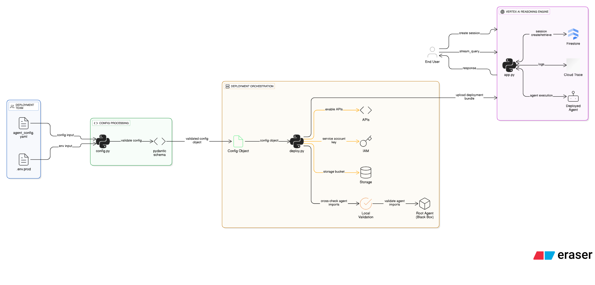
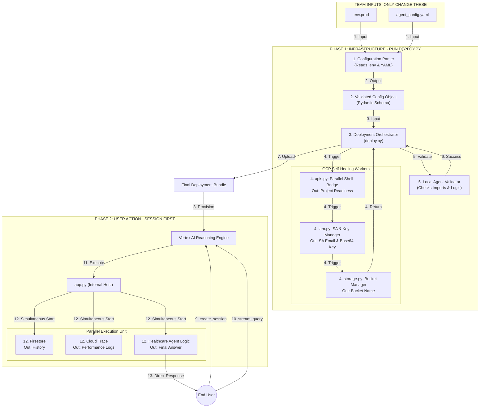

# System Architecture: Vertex AI Agentic Deployment

This document provides structured documentation regarding the system's setup, components, usage, and requirements. It details the project's architecture to ensure clarity for developers contributing to managed services and AI agent logic.

---

## 👁️ System Overview
This project implements a clean separation between **Agent Development** and **Cloud Deployment**. By treating the healthcare agent logic as a modular "Black Box," the infrastructure remains stable and reusable across different agent types.

---

##  AI-Generated Technical Design (Eraser.io)> **[View Live AI Architecture Diagram](https://app.eraser.io/workspace/XH1rb4vAwPz4iYEWb2Vl?origin=share&elements=xjKHsD3alc9o9FCUFfjzow)**




## 🧜‍♂️ Architecture Diagram
The diagram below illustrates the two primary lifecycles of the system.
* **Phase 1 (Infrastructure Action):** The sequential build and deployment pipeline.
* **Phase 2 (User Action):** The parallel execution flow during live user interaction.


## 🧩 Architectural Components

### 1. The Deployment Orchestrator (`deploy.py`)
- **Validation**: Uses `load_agent_from_spec` to verify the agent's package and module entry points locally before cloud submission.
- **Bundling**: Packages local source code with `requirements.txt` into a serialized format compatible with Vertex AI.
- **Self-Healing**: Detects existing agents and handles `force-recreate` logic via low-level API calls.

### 2. Infrastructure Workers (`gcp/`)
Specialized modules that handle the complexity of Google Cloud:
- **`apis.py`**: A **Parallel Shell Bridge** that enables required APIs (IAM, AI Platform, Storage) in a single step using threading.
- **`iam.py`**: Manages the "least-privileged" Service Account and **automatically injects** generated keys into the local web environment.
- **`storage.py`**: Handles staging bucket availability with unique, collision-resistant naming.

### 3. The Runtime Host (`app.py`)
The `AdkApp` wrapper serves as the bridge between the managed Reasoning Engine and your custom code. It ensures that when a query hits, the agent logic is correctly initialized within its own secure environment.


## 🛠️ Phase 1: Infrastructure Action (The Build)

The deployment team manages the infrastructure orchestration. The process is **Sequential** and **Self-Healing**.

### 1. Configuration & Validation (Steps 1-3)

* **Inputs**: The team only modifies `.env.prod` (GCP settings) and `agent_config.yaml` (Agent specs).
* **`config.py`**: Parses raw text into a validated Pydantic object, ensuring no illegal configurations reach the cloud.

### 2. The Modular Workers (Step 4)

The `gcp/` directory contains specialized workers triggered by `deploy.py`:

* **`apis.py`**: Uses a **Parallel Shell Bridge** (ThreadPoolExecutor) to enable all required GCP APIs simultaneously.
* **`iam.py`**: Manages Service Account (SA) creation and **automatically injects** the Base64-encoded SA key into the web environment.
* **`storage.py`**: Ensures a unique global staging bucket exists for asset hosting.

### 3. Local Validation & Activation (Steps 5-8)

* **`load_agent_from_spec`**: Dynamically loads the agent logic locally to catch import or syntax errors **before** deployment.
* **Bundling**: Serializes the agent code and requirements, uploading them to the **Vertex AI Reasoning Engine**.

---

## 🚀 Phase 2: User Action (The Query Flow)

The runtime uses a **Parallel Execution** model to ensure low latency.

### 1. User Protocol (Steps 9-10)

Users must follow a two-step API sequence:

1. **`create_session`**: Initializes the conversation context in Firestore.
2. **`stream_query`**: Sends the medical query to the agent.

### 2. The Simultaneous Runtime (Steps 11-13)

* **`app.py` Wrapper**: Acts as the invisible internal host.
* **Concurrent Execution**: Upon a query, the wrapper triggers three tasks **simultaneously**:
* **Firestore**: Fetches session history.
* **Healthcare Agent**: Reasons through the query using Gemini.
* **Cloud Trace (`tracing.py`)**: Exports performance spans.


* **Direct Response**: The Agent Logic streams the final answer back to the user without further middleware delay.

## 🔄 Data Flow: From Build to Query

### Build Flow (Infrastructure Action)
1. **Source Parsing**: `deploy.py` reads inputs from `.env` and `yaml`.
2. **Infrastructure Prep**: Workers concurrently enable APIs and setup security (Steps 3-4).
3. **Local Audit**: The script imports the agent locally to ensure no missing dependencies (Step 5).
4. **Cloud Provisioning**: The bundle is pushed to the Reasoning Engine (Step 8).

### Query Flow (User Action)
1. **Ingress**: User initializes a session, then sends a query via SSE (Steps 9-10).
2. **Parallel Trigger**: The wrapper simultaneously fetches **Firestore history**, triggers **LLM reasoning**, and exports **Cloud Trace spans** (Step 12).
3. **Egress**: The response streams directly back to the user without intermediate buffering (Step 13).

---

## 📈 Observability & Monitoring
- **Tracing**: All execution steps are tracked via `tracing.py` and exported to **Google Cloud Trace**, providing visibility into the latency of reasoning steps and tool calls.
- **Logging**: Deployment logs provide detailed URLs to the Cloud Console for real-time debugging during failures.

## 🛡️ Security & Compliance
- **Key Injection**: The system eliminates manual secret handling by injecting the generated `GOOGLE_SERVICE_ACCOUNT_KEY_BASE64` into `.env.prod`.
- **Identity**: Agents run under their own dedicated Service Account with specific Vertex AI User permissions.


## 📋 Requirements & Usage

## Deployment Commands

```bash
# 1. Install/Sync dependencies
uv sync

# 2. Deploy to Vertex AI Agent Engine
uv run python deployment/deploy.py

# 3. Force recreate (deletes existing agent first if necessary)
uv run python deployment/deploy.py --force-recreate
```


### Test Commands (Single Line)

**Step 1: Create Session**

```bash
curl -X POST -H "Authorization: Bearer YOUR_TOKEN" -H "Content-Type: application/json" "https://YOUR_LOCATION-aiplatform.googleapis.com/v1/projects/YOUR_PROJECT_ID/locations/YOUR_LOCATION/reasoningEngines/YOUR_ENGINE_ID:query" -d "{\"classMethod\": \"create_session\", \"input\": {\"user_id\": \"YOUR_USER_ID\"}}"

```

**Step 2: Stream Query**

```bash
curl -X POST -H "Authorization: Bearer YOUR_TOKEN" -H "Content-Type: application/json" "https://YOUR_LOCATION-aiplatform.googleapis.com/v1/projects/YOUR_PROJECT_ID/locations/YOUR_LOCATION/reasoningEngines/YOUR_ENGINE_ID:streamQuery?alt=sse" -d "{\"input\": {\"user_id\": \"YOUR_USER_ID\", \"session_id\": \"YOUR_SESSION_ID\", \"message\": \"YOUR_MESSAGE\"}}"

```


